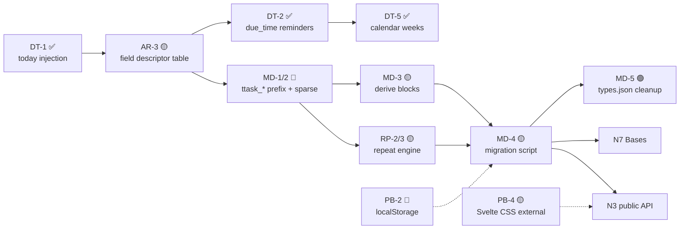
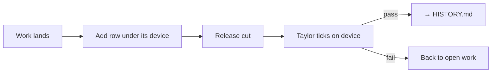

# TTasks — Project Status & Backlog

**The single live document for all open work, every horizon.** Consolidated
2026-08-02 from the former `BACKLOG.md`, `ROADMAP.md`, and `AUDIT_2026-07.md`;
re-ordered around one critical path on 2026-10-08.

- **This file** — current state, all open work, and the rationale behind it.
- **`CLAUDE.md`** — conventions, architecture rules, and dev workflow (how to
  work in this repo, not what's left to do).
- **`Scripts/archive/HISTORY.md`** — the dated journal of everything shipped,
  plus the closed sweeps. Read it for *why* a past decision went the way it did.
- **`API_DESIGN.md`** / **`PROTOCOL.md`** — reference specs (public API awaiting
  review; the `obsidian://ttasks` URI handler).

**Housekeeping rule:** when an item lands, mark it `[x]` with a dated one-liner;
once the thread closes, move the narrative to `HISTORY.md` and leave only the
one-liner here. Open items keep their full rationale; closed ones don't.

**Status legend:** `[ ]` open · `[~]` in progress · `[x]` done
**Needs Taylor:** ⚖ a taste/UX call · 🔎 research or scoping first
**Priority:** 🔴 gates a public release · 🟡 should do · 🟢 opportunistic

---

## Current state (2026-10-09)

| | |
| --- | --- |
| Version | `0.1.16` published 2026-10-09 — awaiting on-device check (Pomodoro sound pickers/volume, midnight rollover, new-task frontmatter). Not on the community list — deliberate |
| Tests | **1920 passing, 141 files** (`npm run check` = lint → build → test) |
| CI | Green on push/PR/dispatch, Node **22 + 24** matrix; rig smoke covers 11 scenes |
| Release | `npm version patch && git push --follow-tags` |
| Deploy | `npm run build` copies into the vault; `npm run dev` does not |
| Licence | GPL-3.0-or-later |

**Phases 1–4, 6, and 7 are complete.** Core CRUD, kanban, mobile layouts,
search/filter, dependency graph, reminders, quick actions, archive/logbook, the
`area`/`labels` data model, the shared query engine, Smart Lists, native
Pomodoro, and Share/Sync all ship.

**Two things gate a public release** (both 🔴 below): **MD-1/MD-2** (schema
prefix + sparse writes) and **PB-2's last bullet** (`localStorage` namespacing).
*(DT-2 landed 2026-10-09, pending an on-device check.)*
Everything else is 🟡/🟢.

**No ⚖ call blocks any 🔴 item.** DT-2 and DT-5 are *decided* (2026-07-25) and
only need implementing. The open taste calls are all UI polish (see §C).

---

## Critical path

One ordering for the release-gating and schema work. Each step is independently
shippable; dependencies are the arrows.



| # | Step | Why here |
| --- | --- | --- |
| 1 | ~~**DT-1** engine `today` injection~~ ✅ 2026-10-09 | Independent, user-visible bug, and makes every later date test deterministic (closes TD-5). |
| 2 | **AR-3** field descriptor table | Slices 1–2 landed; the JSON export/import lists and `TASK_FIELD_DEFINITIONS` are still hand-listed. `due_time` was added to the latter ahead of that. *(Previously sequenced after DT-2 — flipped 2026-10-08.)* |
| 3 | ~~**DT-2** `due_time` reminders~~ ✅ 2026-10-09 | UI + `due-time-passed` reminder. |
| 4 | ~~**DT-5** calendar weeks + week-start setting~~ ✅ 2026-10-09 | Includes the Logbook "Last 7 Days" rename. |
| 5 | **MD-1 / MD-2** `ttask_*` prefix + sparse writes | The schema change everything downstream depends on. |
| 6 | **MD-3** derive `blocks` | Deletes the sync machinery; do it in the same schema break, not a second one. |
| 7 | **RP** `src/repeat/` engine → integration → builder UI | Adds `ttask_repeat_*` keys, so it rides the same break. Folds in DT-4. |
| 8 | **MD-4** one-shot migration script, then **MD-5** | Converts the vault once; **zero legacy code ships**. Handle `localStorage` (PB-2) before this so the script's cutover is the only one. |
| 9 | **N7 Bases**, **N3 public API** | Both expose property names. Do them *after* MD-1 or rewrite them. README's data-model section and the API doc examples also change at step 5. |
| — | **PB-4** Svelte CSS external | Before `styles.css` becomes a public surface for theme authors. Not on the arrows' path; do it any time before N3/publishing. |
| — | **AR-2** TaskGraph decomposition | Before further graph work (GP5, §C #12, #16). |
| — | **DT-6 + AR-5** ISO-date / DRY sweep | Opportunistic; ride along with DT-1. |

---

## A. Release-gating work

### Dates (DT)

- `[x]` **DT-1** — engine `today` injection *(2026-10-09; see HISTORY)*. Also
  closes TD-5 for the query engine.
- `[x]` **DT-2 🔴 `due_time` is stored but semantically dead** — *(2026-10-09, unreleased: `time` field type + `TimeField`, detail-pane and create-modal control (shown only with a due date; clearing the date clears the time), `due-time-passed` reminder, `localTimeString`; gated by the existing "due today" toggle. Awaiting on-device check.)* Original scope: **decided
  2026-07-25 (Taylor): make it real, reminders only.**
  - **Scope is bigger than the audit stated.** `due_time` is persisted, written,
    sortable, and offered in the query editor but consumed by nothing. It's also
    **not settable** — no entry in `TASK_FIELD_DEFINITIONS`, so no create-modal or
    detail-pane control exists. Today it only arrives via the emoji-capture parser
    or JSON import. So this needs **UI + consumption**, not just consumption.
  - **Reminders only, not overdue.** A new `due-time-passed` rule (due today +
    `due_time` < now + not complete) on the existing 5-minute poll. Overdue
    styling stays **date-based** — a 09:00 task is not overdue-red at 09:01,
    because overdue drives colour across list, kanban, and graph, so a
    time-sensitive overdue would have rows flipping state through the day and a
    morning-heavy schedule going red by lunchtime. **Document the asymmetry
    explicitly** — the reminder fires, the styling doesn't change.
  - `dateUtils` gains the one missing primitive `localTimeString(now): 'HH:MM'`
    so `new Date()` stays out of the pure rules.
  - **Not** a move to datetime-everywhere. `dateUtils.ts` documents the opposite
    as a deliberate choice, and Obsidian's native "Date & time" type on `due_date`
    is deliberately reduced to its calendar-date portion by `toCalendarDate`.
    `due_date` + `due_time` already *are* a local datetime split across two
    fields — this just makes the second one count.
- `[x]` **DT-5 🟡 "This week" is a rolling 7 days, not a calendar week** — *(2026-10-09, unreleased: agenda This/Next Week are calendar weeks; new "Week starts on" setting (System default → Sunday/Monday override) under Working calendar; Logbook bucket key renamed `last-7-days`; `within_days` confirmed in the query editor's date operators. See HISTORY.)* Original scope:
  **decided 2026-07-25 (Taylor): real calendar weeks, keeping rolling windows
  where they suit.**
  - **Current** (`engine.ts`, `agendaBuckets.ts`): `today+1` → Tomorrow,
    `≤ today+7` → This Week, `≤ today+14` → Next Week. The distortion grows
    through the week — near-correct on the first day, almost entirely *next* week
    by Friday. The practical cost is that "what's left this week?" can't be
    answered, because the bucket refills from the future as the week drains.
  - **Target:** calendar-week bucketing plus a new **week-starts-on** setting
    (Sun/Mon). Matches TickTick/Things. *(No such setting exists yet.)*
  - **Rolling stays first-class** (Taylor: *"I do like the idea of having a
    rolling window for some things as well"*). It already exists as the
    `within_days` filter operator (present in the query editor's date operators);
    confirm it's discoverable rather than building a second mechanism.
  - **Second bucket to align:** the Logbook has its own unrelated `this-week`
    (`LogbookBucketKey` in `engine.ts` — completed within the last 7 days, rolling
    *backwards*) — same label, opposite direction. A look-back window arguably
    *should* stay rolling, so the likely resolution is to keep the behaviour and
    **rename it "Last 7 Days"**. Decide alongside the agenda change so they don't
    drift again.
- `[~]` **DT-4 🟡 `recurrence.ts` vs. the dateUtils contract** — the wrong doc
  comment and the duplicated days-in-month clamp are fixed (2026-07-25).
  **Still open:** folding `advanceDate` onto `dateUtils` primitives so the module
  stops carrying its own parse/format. Done as part of the RP redesign.
- `[ ]` **DT-6 🟢 consolidation + enforcement** — add `isIsoDateString` and sweep
  the duplicate ISO-date regexes (8 at audit time; **11 pattern hits in non-test
  `src` on 2026-10-08**, including `holidays.ts`, `workingCalendarSettingsSection.ts`,
  `protocol.ts`); move `formatHumanDate` next to `MONTH_ABBR`; enforce no bare
  `new Date()` outside the boundary (**38 call sites outside tests/mocks today**).
- `[x]` **DT-7** — agenda/kanban honour the dependency-chain-inferred date
  *(2026-09-09, 0.1.13; see HISTORY)*.

### Frontmatter / schema hygiene (MD)

> **Plan approved 2026-10-10:** see `SCHEMA_BREAK_PLAN.md`. MD-2/MD-3 ship ahead of
> the rename; only the rename + migration is the cutover. **MD-0** (route every
> frontmatter key through `fmKey()`) is done — see HISTORY.

- `[ ]` **MD-1 🔴 prefix the schema `ttask_*`** — the plugin's generic property
  names (`type`, `name`, `status`, `priority`, …) pollute the vault-wide property
  suggestion pool and collide with other plugins' conventions. *(No `ttask_`
  keys exist in `src` yet; README's "planned" note is accurate.)*
- `[ ]` **MD-2 🔴 sparse writes** — stop writing null/empty keys on creation;
  every task note currently carries the full key set whether used or not.
- `[ ]` **MD-3 🟡 stop persisting `blocks`** — it's a pure reverse index of
  `depends_on` and can be derived at load, which deletes the whole sync machinery
  and the `sync-blocks` command. *(CLAUDE.md and README currently describe
  `blocks` as auto-maintained; update both when this lands.)*
- `[ ]` **MD-4 🟡 one-shot vault migration + dev-command pruning** — a standalone
  `Scripts/migrate-prefixed-schema.mjs`, run once with Obsidian closed, does
  MD-1/MD-2/MD-3 plus the legacy-recurrence conversion, so **zero legacy code
  ships**. The dev-phase migration commands then get deleted.
- `[ ]` **MD-5 🟢 property registry cleanup** — hand-edit the vault's `types.json`
  (Obsidian closed) to drop the old generic entries; document recommended
  property types.

### Repeat mechanism (RP) — redesign

RP-1 (month-end drift) was **fixed 2026-07-25** via a persisted anchor day. The
remaining two items are resolved by the redesign below, which is specified in
full because it's the largest single piece of open work. Nothing under
`src/repeat/` exists yet.

- `[ ]` **RP-2 🟡 expressiveness** — no "every N", weekday sets, nth-weekday,
  weekday classes, end conditions, or working-day awareness.
- `[ ]` **RP-3 🟡 fragile recurrence identity** — the spawn dedupe guard in
  `decideCompletion` matches on task **name**, so renaming a recurring task with
  an open instance breaks the guard and double-spawns. Fixed by construction in
  the redesign via stable series identity.

**Storage — flat, prefixed frontmatter keys** (settled with Taylor 2026-07-12;
supersedes an earlier human-DSL proposal). Rationale: a builder must be the
primary entry path anyway, which makes a DSL a lossy round-trip layer with its own
parser to maintain; and nested YAML objects are second-class in Obsidian — the
Properties panel renders them as an uneditable blob and Bases can't reach into
them. Flat scalar/list keys are native everywhere. No legacy compatibility: the
vault is converted by the MD-4 script.

```yaml
# every 2 weeks on Mon/Wed
ttask_repeat_every: 2
ttask_repeat_unit: week
ttask_repeat_weekdays: [mon, wed]

# first working day of the month, 12 times
ttask_repeat_every: 1
ttask_repeat_unit: month
ttask_repeat_nth: 1
ttask_repeat_nth_target: working-day
ttask_repeat_count: 12
```

| Key | Type | Applies to |
| --- | --- | --- |
| `ttask_repeat_every` | number ≥ 1 | all — presence means "repeats" |
| `ttask_repeat_unit` | `day\|week\|month\|year` | all |
| `ttask_repeat_weekdays` | list of `mon…sun` | week |
| `ttask_repeat_monthday` | number or `last` | month; year (with `_month`) |
| `ttask_repeat_month` | 1–12 | year |
| `ttask_repeat_nth` | 1–5 or -1 (last) | month |
| `ttask_repeat_nth_target` | `mon…sun`, `day`, `weekday`, `weekend-day`, `working-day` | month |
| `ttask_repeat_basis` | `completion` (omit = schedule) | all |
| `ttask_repeat_roll` | `next\|previous` (omit = keep) | all |
| `ttask_repeat_until` | YYYY-MM-DD | end condition |
| `ttask_repeat_count` | number (remaining spawns) | end condition |
| `ttask_repeat_of` | wiki-link to the previous instance | spawned instances (RP-3) |

Yearly reuses `_monthday` + `_month` rather than inventing a third date shape.
Typical rules touch 2–4 keys; non-repeating tasks have zero (sparse-write
discipline, MD-2).

**Modules — `src/repeat/`, pure:**

```ts
export interface RepeatRule {
  every: number;                          // ≥ 1
  unit: 'day' | 'week' | 'month' | 'year';
  weekdays?: Weekday[];                   // unit=week
  monthday?: number | 'last';             // unit=month|year; exclusive with nth
  month?: number;                         // unit=year
  nth?: { n: 1 | 2 | 3 | 4 | 5 | -1; target: NthTarget }; // unit=month
  basis?: 'schedule' | 'completion';      // default 'schedule'
  roll?: 'next' | 'previous';             // working-day roll; default keep
  until?: string;                         // YYYY-MM-DD
  count?: number;                         // remaining occurrences
}
export type NthTarget = Weekday | 'day' | 'weekday' | 'weekend-day' | 'working-day';
```

- **`repeat/normalize.ts`** — the read boundary. Gathers `ttask_repeat_*` keys,
  coerces types, enforces invariants. An inconsistent hand-edited combo
  normalizes to `null` **with a warning badge on the task** — never a silent
  guess. There is deliberately no natural-language parser.
- **`repeat/describe.ts`** — `describeRepeat(rule): string` for UI labels.
  Display-only; nothing parses it back.
- **`repeat/next.ts`** — `nextOccurrence(rule, anchor, after, calendar?)`.
  **Anchor-based, never last-occurrence-based**, so monthly `day 31` re-derives
  each month (Jan 31 → Feb 28 → **Mar 31**), fixing RP-1 by construction.
  `working-day`/`weekend-day` targets consult the existing `WorkingCalendar`.
  Holiday-aware recurrence — "first working day of the month" skipping Jan 1 — is
  a genuine differentiator no mainstream task app offers. Returns `null` when
  `until`/`count` is exhausted, so the completion path simply doesn't spawn.

**Settled edge semantics** (encode as a test table): "last weekend" means the
last weekend *day* (Things/Apple semantics); an **nth that doesn't exist** ("5th
Tuesday" in a 4-Tuesday month) **skips the month** rather than clamping, because
clamping reintroduces drift-shaped surprises; leap-day yearly clamps to Feb 28 in
non-leap years; v1 excludes multiple month-days.

**UX — three layers over one model**, all reading/writing the same `RepeatRule`:
contextual presets derived from the due date (Google Calendar style), a custom
builder, and raw YAML editing. The **next-3-occurrences preview** is the
highest-value element — it's how a user verifies "first working day of the month"
does what they meant, and it's nearly free.

**Integration:** `decideCompletion`/`completeAndRecur` call `nextOccurrence`;
spawned instances carry `ttask_repeat_of` and the dedupe guard matches on that
link, not `name`; `count` decrements on spawn; `recurrence.ts` is deleted after
its tests are ported.

### Publication leftovers (PB)

Review-bot sweep, README, release scaffolding, and manifest polish are **done**
(PB-1/PB-3 2026-08-02/08-31, PB-2 2026-08-31 — see HISTORY). What remains:

- `[ ]` **PB-2 🔴 `localStorage` namespacing** — not a quick win: swapping
  `reminderStorage`/`vaultSafe` onto `app.loadLocalStorage()`/`saveLocalStorage()`
  changes the key namespace, so it needs a migration for already-stored fired
  reminders and snoozes. Per-device semantics are correct — keep them. Also
  touches `CreateTaskModal`'s two mobile-quick-create keys, which read
  `localStorage` directly. Fold the cutover into the same release as the schema
  break so users see one migration, not two.
- `[ ]` **PB-4 🟡 Svelte CSS is JS-injected** — `esbuild.config.mjs` runs
  `esbuild-svelte` with `css: "injected"`, so component styles become runtime
  `<style>` elements, contradicting the "all CSS belongs in `styles.css`" rule.
  Effect: component CSS bypasses `styles.css`, can't be overridden predictably by
  theme snippets, and briefly FOUCs on view open. Switch to `css: 'external'` and
  concatenate onto `styles.css` at build. **Do it before `styles.css` becomes a
  public API for theme authors.**
- `[ ]` **`fundingUrl`** — not set; optional, Taylor's call.

*Already publication-clean (PB-5):* no network calls, no telemetry, no
Node/Electron imports in `src`, `isDesktopOnly: false` matches mobile support,
`processFrontMatter` for all frontmatter mutation, no leaf detaching in
`onunload`, intervals/events registered for cleanup, `normalizePath` at vault
boundaries, `seed-graph-test-data` dev-gated out of production. Submitting to
`obsidianmd/obsidian-releases` stays **deliberately out of scope**.

---

## B. Verification tracker — by device

Everything here is *built and shipped* (or queued for the next release) but cannot
be observed headless: the rig has no Obsidian mobile shell, `Modal` chrome,
settings tab, leaves, or status bar. Taylor can only test a **cut release**, so
each row names the version it first ships in. One on-device pass per device,
ticking rows off; when a row passes, mark it `[x]` with the date and version.
The pass also closes the "Visual regression pass" (dark/light × desktop/phone).

**Maintenance rule:** when work lands that touches UI or device behaviour, add a
row here *in the same commit* (device · what to do · what "pass" looks like ·
version). Move closed rows to `HISTORY.md` once a release has been ticked.



### 📱 iOS (iPhone/iPad)

| | Check | Pass looks like | Ships |
| --- | --- | --- | --- |
| `[ ]` | **Due Time input** (DT-2) — create modal and detail pane | Native time picker opens; field appears only once a due date is set; clearing the date hides it | next |
| `[ ]` | **Mobile golden path** floor check | Create → edit → complete a task at phone width, no clipped controls | — |
| `[~]` | **Graph: detail drawer** after tapping a node in fullscreen graph | Modal closes, drawer is visible and on top (fix: rAF hand-off + `active: Platform.isMobile`) | 0.1.x |
| `[~]` | **Graph: double-tap-to-open** | One tap opens (fix: `pointerup` on touch, 8 px drag threshold) | 0.1.x |
| `[~]` | **Detail pane fits the drawer** | Single column below 768 px, no horizontal scroll | 0.1.x |
| `[~]` | **Ghost sidebar tabs** — disable → relaunch → re-enable | Exactly one live tab, no ghost/duplicate (`views/leafHygiene.ts`) | 0.1.3 |
| `[ ]` | **Agenda calendar weeks** (DT-5) — Agenda view, then flip Settings → Working calendar → Week starts on | Tomorrow / This Week / Next Week follow real weeks; This Week hides when tomorrow is already next week; setting change re-buckets live | next |
| `[ ]` | **Midnight rollover** (DT-1) — leave a view open across midnight | Today/Overdue buckets refresh without reopening | 0.1.16 |
| `[ ]` | **New-task frontmatter** (AR-3) — create a task, inspect YAML | Same keys/order as before the codec change | 0.1.16 |

### 🤖 Android

| | Check | Pass looks like | Ships |
| --- | --- | --- | --- |
| `[ ]` | **Pomodoro vibration** on phase end | Device vibrates; sticky Notice shows | 0.1.x |
| `[ ]` | **Due Time input** (DT-2) | As iOS row | next |
| `[ ]` | **Graph double-tap** — 700 ms ghost-click guard | One tap opens, no double-open | 0.1.x |

### 🖥 Desktop (Windows, Obsidian)

| | Check | Pass looks like | Ships |
| --- | --- | --- | --- |
| `[ ]` | **Week starts on** (DT-5) — Settings → Working calendar | Dropdown at top of the section, default "System default (Mon/Sun)" matching your device locale; Monday vs Sunday moves Sunday between This/Next Week | next |
| `[ ]` | **"Due now" reminder** (DT-2) — task due today with `due_time` a few minutes ahead; wait for the 5-min poll | Notice reads "N due now"; fires once; task is *not* styled overdue; follows the "Due today" toggle | next |
| `[ ]` | **Pomodoro → "Send test"** notification | Reports shown/denied/unsupported; "shown" with nothing visible = Focus Assist / per-app setting | 0.1.16 |
| `[ ]` | **Pomodoro sounds** — preview buttons, separate focus-end / break-end picks, volume slider (0 = off; saved "off" migrates to 0) | Audio plays at the set volume | 0.1.16 |
| `[ ]` | **Pomodoro rest** — CSV log (tasks folder, optional year/month split), two modals, sidebar pane, status-bar item (idle hides), OS notification click → pane | Each behaves as described | 0.1.x |
| `[ ]` | **`tt-btn-primary`** (Mark complete, empty-list "+ New task") | Filled plugin-wide | 0.1.x |
| `[ ]` | **Share/Sync** modal, both tabs | Renders and round-trips in the real shell | 0.1.x |
| `[ ]` | **Settings tab** — AI export prompt library (textarea width, disabled "Restore default", read-only interop list); P7 overhaul | Layout intact; not a rig scene | 0.1.x |
| `[ ]` | **`QueryEditorModal`** — three `✕` → icon buttons | Icons render; no rig scene | 0.1.x |
| `[ ]` | **`GraphExpandModal`** — double-close fix | Single close button | 0.1.x |
| `[~]` | **Obsidian API-guidance sweep** (2026-08-07) | Only the QueryEditor icon swap is UI-facing | — |

**Cloud-session note:** the SessionStart hook runs `rig:sync-css`, so a cloud
session has real Obsidian + Underwater CSS and `rig:shots` works there. That still
isn't Obsidian itself.

---

## C. Open feature & UX threads

### Status semantics — Blocked vs Hold

- `[~]` **(6) Blocked vs Hold verbiage** — **defined by Taylor 2026-07-25:**
  - **Blocked** — *"I need to escalate something, or something is just impossible
    at the current moment."* An **external impediment**: the work cannot move
    until someone or something outside the task clears it.
  - **Hold** — *"awaiting a confirmation of delegated work, paused due to some
    other priority."* A **deliberate pause**: the work *could* proceed but has
    been consciously set down.

  The distinguishing axis is **can't vs. won't-right-now**, not severity.
  **Remaining:** reflect this in UI wording/tooltips and in the `blocked_reason`
  field copy, which still reads "Why is this task blocked?" and only fits the
  Blocked case (`src/schema/taskFields.ts`).
- `[x]` **(8) Cascade to dependents** — engine 2026-07-25
  (`src/query/taskImpediment.ts`, Blocked > Hold > Future, derived never written);
  UI surfacing shipped as `.tt-badge-impediment` on rows and kanban cards
  (by 2026-07-31). **Residual** `[ ]`: the detail pane doesn't show the badge —
  decide whether it should (the Relationships section already marks blocked
  upstream nodes).

### Graph polish

*Schedule AR-2 (TaskGraph decomposition) before the larger items here.*

- `[~]` **GP5 — lane-header focus interaction** — the `+` add-subshape shipped
  (tap → add a task parented to the project). A first rev made the header body a
  pin toggle that grew the pinned lane to reveal its full vertical title; Taylor
  felt it was *"not that nice… come back and tune later,"* so both were **backed
  out**. Remaining: a header-focus affordance that feels good, plus the
  full-title grow reveal.
- `[ ]` **(12) Drag connectors to create dependency chains** 🔎 — click-and-drag
  a node's connector (left = depends-on, right = blocks) to link it to another
  node. Needs interaction-design research: hit targets, drop targets, touch
  equivalent.
- `[ ]` **(16) Vertical sort: rank completed items lower** ⚖ — current order
  reads as priority-based; Taylor's instinct is that completed items should sink
  regardless of priority. Needs a taste call on the exact rule.
- `[ ]` **GP2 residue** ⚖ (minor) — Blocked/Cycle count pills hide at zero; if
  Taylor prefers them always visible it's a two-line revert.
- `[x]` Timeline blank with a single lane; Gantt pinned name column; graph
  fullscreen double-close button *(2026-08-07 / 08-31; see HISTORY)*.

### Search & filters

- `[ ]` **Filter-bar search box on phone width** ⚖ — desktop is fixed (148 px
  `min-width`, due-date range moved into a dropdown, 2026-08-31). At phone width
  it still collapses to the magnifier icon alone, so the placeholder and typed
  query are invisible and there's nowhere to hint at `#hash`. Needs a taste call:
  its own row, an expanding icon-button, or shrink the selects.
- `[x]` Search by hash prefix (2026-08-05); Excel-style filter dropdowns
  (2026-08-31).

### Feedback items

- `[ ]` **Status / Priority badges: selected vs. regular hard to distinguish,
  worse in dark mode** ⚖ — likely a colour-spine follow-on (badges went
  monochrome in V2). Needs a taste call on how much contrast the selected state
  should carry.
- `[x]` **(14) Dependency-picker sorting** — *(2026-10-08)* real bug: the
  comparator did `a.parent_task === currentParentTask`, but stored tasks carry
  `.md` while the create modal's form value is extensionless, so "same project
  first" never matched there (the detail pane happened to work). Both sides now
  go through `normalizeRefPath`. Not addressed: completed/cancelled tasks still
  appear in the pickers — say if that is the other half of the complaint.
- `[ ]` **Share/Sync import: from regular notes** 🔎 — the Import tab only
  accepts a pasted JSON export. Needs scoping: "point at a note and parse tasks
  out of it" (adjacent to the checkbox-scan/promote flow) or something else.
- `[ ]` **Share/Sync import command surface** *(deferred)* — a direct
  import-from-clipboard command.
- `[ ]` **A renamed task leaves stale link aliases** — links are stored
  `[[path|Name]]`, and neither the detail-pane rename nor the import rename
  rewrites the alias on inbound `depends_on`/`blocks`/`parent_task` entries. The
  TTasks UI is unaffected (it resolves through `resolveTaskRef`), so this only
  shows in **native Obsidian views**. Pre-existing. *(MD-3 removes the `blocks`
  half of this.)*
- `[x]` Subprojects UI; Future cascades down; right-click Open; Share/Sync graph
  answers + weak-model wording; hover-transform scrollbar flicker; field CSS
  dedupe *(2026-08-24 → 2026-09-06; see HISTORY)*.

### Pomodoro

Core and all optional slices are done (state machine, service, detail-pane
control, settings, untethered sessions, CSV log, "focus until", sidebar pane,
status-bar countdown, log-partial-on-stop). Live sign-off is in §B.

- `[ ]` **(15) Pomodoro discoverability** — no obvious way to find the sidebar
  icon or open the pane. Needs a clearer entry point: ribbon icon (the only
  ribbon icon today opens the board), command-palette hint, or an onboarding
  nudge.

---

## D. Architecture, CSS & test debt

Phase 4 — ongoing, PR-sized. None of it is user-visible, so none of it blocks the
critical path except where noted above (AR-3, PB-4).

- `[~]` **AR-3 🟡 the Task field schema is defined in four places** — *slices 1–2
  landed 2026-10-09:* `src/schema/taskPersistence.ts` is a `Record<keyof Task,
  FieldPersistence>` (`fmKey` / `kind` / `updatable` / `onCreate` / `seed`), and
  `src/schema/taskCodec.ts` reads (`readStoredFields`) and writes
  (`serializeNewTaskFrontmatter`) from it. `fileToTask`, `buildTaskFrontmatter`
  and `update()`'s field list no longer carry their own lists; a new `Task` field
  is a compile error until described. **Remaining:** the JSON export/import field
  lists (`taskJsonExport`/`taskJsonImport`) and `TASK_FIELD_DEFINITIONS` still
  hand-list fields (test-guarded against the table, not generated). MD-1 renames
  keys via `fmKey`; MD-2 flips `onCreate` to omit-when-empty. **Unblocks DT-2.**
- `[ ]` **AR-1 🟡 the component→plugin coupling rule is violated by all ten legacy
  components** (`TaskAgenda`, `TaskArchiveView`, `TaskBoard`, `TaskDetail`,
  `TaskDetailNotes`, `TaskDetailRelationships`, `TaskGraph`, `TaskKanban`,
  `TaskList`, `TaskRow` — verified 2026-10-08). **Plan:** a `BoardContext` of
  callbacks/service refs, migrated component by component, each with a render test
  (TD-4). *(Demoted from 🔴 on 2026-10-08: it's a code-health rule, no user sees
  it, and the release-gate summary never counted it.)*
- `[ ]` **AR-2 🟡 `TaskGraph.svelte` is a ~2,750-line god component** (was
  ~2,125 at audit time and has grown) — schedule ahead of further graph work.
- `[ ]` **AR-6 🟢 the codec's `kind` is not type-checked against the field** —
  *(code audit 2026-10-09)* `TASK_PERSISTENCE` forces every `Task` key to be
  described, but nothing ties the `kind` to the field's TypeScript type:
  `labels: editable('labels', 'number')` compiles, and `readStoredFields` returns
  through `as unknown as StoredTaskFields`, so the mistake surfaces only at
  runtime. Fix: a `KindValue` map (`strings → string[]`, `date → string | null`, …)
  and a mapped type so each entry's `kind` must produce `Task[field]`. Same
  change can drop the cast.
- `[ ]` **AR-7 🟢 settings normalization imports the audio module** — *(code
  audit 2026-10-09)* `settings/defaults.ts` imports `isPomodoroAlertSound` from
  `integration/pomodoroAlert.ts`, which also holds the Web Audio synth and the
  Electron notification code. Not a boundary violation (it's Obsidian-free), but
  the sound *catalogue* (ids, labels, guard, note table) is data the settings
  layer needs and playback is a side effect it doesn't. Split a
  `pomodoroSounds.ts` out; `pomodoroAlert.ts` keeps `playAlertSound` /
  `showSystemNotification`.
- `[ ]` **🟢 Pomodoro volume slider saves on every step** — it calls
  `saveSettings()` (full normalize + write) on each 5-point step while dragging.
  Harmless at this size; worth a debounce if the settings payload grows.
- `[ ]` **AR-4 🟡 `TaskWriter` mixes four concerns** — extract a
  `ChecklistSyncService`.
- `[ ]` **AR-5 🟢 smaller DRY / correctness items** — including the duplicate
  ISO-date regexes (with DT-6).
  *Added by the 2026-10-09 audit (all comment/verbosity nits, no behaviour):*
  `taskPersistence.ts` has two stacked JSDoc blocks, so the module header is
  orphaned onto `FieldKind`; its `onCreate: 'when-set'` doc says "only for a
  recurring task" (that's the one current user — the semantics are "only when
  non-null"); the `ENTRIES` cast is duplicated in `taskPersistence.ts` and
  `taskCodec.ts` (export it once); `createTimeFrontmatterKeys` is a test-only
  export.
- `[ ]` **TD-3 🟡 coverage visibility** — no coverage reporting configured.
- `[ ]` **TD-4 🟢 component-test debt** — tracks AR-1; fold "add a render test"
  into each component migration.
- `[x]` **TD-5 🟢 date/time determinism** — closed for the query engine by DT-1's
  `today` injection (2026-10-09).
- `[ ]` **Detail pane suppresses every field's real `<label>`** — found in the
  2026-09-06 UI audit. `deriveInlineFieldProps` sets `definition.label = ''` so
  `TaskDetail` can render its own `<div class="tt-field-group"><span
  class="tt-label">`. Net effect: ~32 extra nodes and **no control in the detail
  pane has a programmatic label** (the field components already emit `<label
  for={definition.name}>`). Fix is a deletion: stop blanking, drop the wrapper and
  span. Watch `.tt-detail > .tt-field-group` in `styles.css`, which centres the
  top block and would need rehoming.
- `[ ]` **A plugin root misses the design tokens** — `.tt-graph-fullscreen-modal`
  isn't in the token-root list in `styles.css` (`.tt-pomodoro-view` joined it
  2026-10-08), so
  `--tt-space-*` / `--tt-control-*` fall back to per-use defaults. Mostly a no-op
  today because the fallbacks mirror the token values.
- `[ ]` **Hand-rolled popovers could be the native Popover API** —
  `FilterDropdown` and the graph's project filter each carry a window `mousedown`
  listener plus a capture-phase Escape handler to reimplement light-dismiss.
  `popover` + `popovertarget` gives both and puts the menu in the top layer. Check
  the `minAppVersion` (1.7.2) Electron floor first.
- `[ ]` **`ImportConfirmModal` duplicates `confirmModal.ts`** — same
  open/cancel/confirm shape as its own `Modal` subclass. Small, low-risk.

---

## E. Gated on Taylor (not headless-workable)

- `[ ]` **N3 public API — review, then implement** — `API_DESIGN.md` is written and
  Taylor's decisions on the five open questions are recorded (2026-07-09);
  implementation ships only after Taylor's review of the final doc. **Wait for
  AR-3 and MD-1**: the descriptor table changes how API fields are exposed, and
  the prefix rename changes every property name the doc's examples use.
- `[ ]` **N7 Bases compatibility** — needs the live vault with Bases enabled. Ship
  `Scripts/TTasks.base` (views: Active, Due this week, By area, project rollup),
  verify aliased wiki-links / `labels` list / quoted date fields resolve, document
  in the README. **Do it after MD-1**, so the `.base` file isn't written against
  property names that are about to change. **No schema changes** without a
  written proposal first.
- `[ ]` **C2-F2 mid-column whitespace** ⚖ — a semantic tradeoff: pulling
  source-only nodes rightward changes what a column *means* and can perturb the
  0-crossing layout. Full analysis in `HISTORY.md` (C2 workshop).

---

## F. Later — roadmap features

Roughly priority-ordered within each group; not committed. *(Re-checked
2026-10-08: none of these have started — no code-block processor, no native
`Notification` use, no milestone or Eisenhower code, no density toggle.)*

**Power features**

- `[ ]` **Centralized notification + error-handling system, + desktop native
  notifications** 🔎 — *scoped 2026-07-21.* Notification firing is **fractured**:
  50+ ad-hoc `new Notice(...)` call sites, each building its message inline. The
  only shared helper is reminder-specific. **No code anywhere uses the
  native/Electron `Notification` API**, so nothing surfaces at OS level when
  Obsidian is backgrounded — presumably the itch behind the ask.
  - **Folded in:** the error/failure path is fractured the same way and worse —
    no single try/catch → log → notify helper exists. At least four inconsistent
    patterns coexist (`plugin.log()` + `Notice`; silent `console.warn` with no
    user feedback; `console.error` + `Notice`; and three separate mini-helpers
    each covering only their own call sites). *(Partly improved 2026-08-31:
    `plugin.log` is dev-gated and `plugin.logError` always reports.)*
  - **Direction:** one `NotificationService` owning success/info/error variants
    that every call site routes through. On desktop additionally fire the
    Web/Electron `Notification` API with a click handler that focuses the window
    and navigates to the task. On mobile the API isn't available — gate behind
    `Platform.isDesktop`, mobile stays `Notice`-only. New setting defaulting
    **off** (it triggers a permission prompt).
  - **Still needs scoping:** which notification *types* get the native upgrade
    (Pomodoro phase-complete and due-date reminders are the obvious candidates;
    error/CRUD notices stay in-app). DT-2's `due-time-passed` reminder is a
    natural first consumer.
- `[ ]` **Natural language quick capture** — parse `Fix bug #high due:tomorrow
  @Project blocking:abc123` from palette / status bar / mobile FAB. Unblocked
  (was gated on a stable filter engine). *(The emoji-field capture parser exists;
  this is a different, free-text grammar.)*
- `[ ]` **Capacity-aware Today planner** — a "for today" flag independent of due
  date; suggest top tasks by `estimated_days` vs. available hours; overload
  warning. May overlap Cycles — design together.
- `[ ]` **Cycles / Sprints (investigate)** — time-boxed windows; pull tasks in,
  track velocity.
- `[ ]` **Obsidian ecosystem compatibility** — daily-note integration,
  Tasks-plugin `- [ ]` render, Dataview/Datacore schema compat, Templater hooks.
  **The Templater-hooks / "expose API" piece is the same work as N3** — dedupe
  when N3 lands.
- `[ ]` **Markdown code-block processor** — ```` ```ttasks filter:… ```` embeds a
  live task list in any note. High value if the plugin is ever published.

**Data-model expansion** *(each adds frontmatter or body structure — land after
MD-1/MD-4 so they're born prefixed)*

- `[ ]` **Activity log on tasks** — timestamped append-only log in the note body;
  auto-entries for status/creation/completion/recurrence; manual comments;
  renders as a detail-panel timeline. Pomodoro session logging is a first
  consumer — consider building the shared log here.
- `[ ]` **Milestones within projects** — zero-effort dated task that gates
  downstream deps; diamond node in the graph; markers on the timeline.
- `[ ]` **Icon/emoji field** for statuses/areas/labels — separate `icon` from
  `label` so compact views can be icon-only.
- `[ ]` **Eisenhower Matrix view** — 2×2 Important × Urgent; urgent from
  due-proximity, important from priority.
- `[ ]` **Sections within projects** — sub-grouping (`Design`/`Dev`/`QA`);
  investigate a `section` field vs. lightweight `parent_task` grouping.

**Small, still-open**

- `[ ]` **Kanban drag-to-reorder within a column** (priority ordering).
- `[ ]` **Card density toggle** (compact vs. detailed) — the per-card *field* set
  shipped; a density toggle did not.

**Deferred / investigate later** (parked, needs a design or a precondition)

- `[ ]` **Evening review modal** (GTD clarify) — needs the Capacity planner first.
- `[ ]` **Workload view** — needs a real multi-user `assigned_to` story.
- `[ ]` **Habit tracking** — arguably its own plugin; revisit post-core.
- `[ ]` **CodeMirror embed / true Live Preview in detail** — deferred (mobile
  keyboard risk).
- `[ ]` **Mobile authoring toolbar** — floating row above the keyboard; deferred
  (WKWebView complexity).
