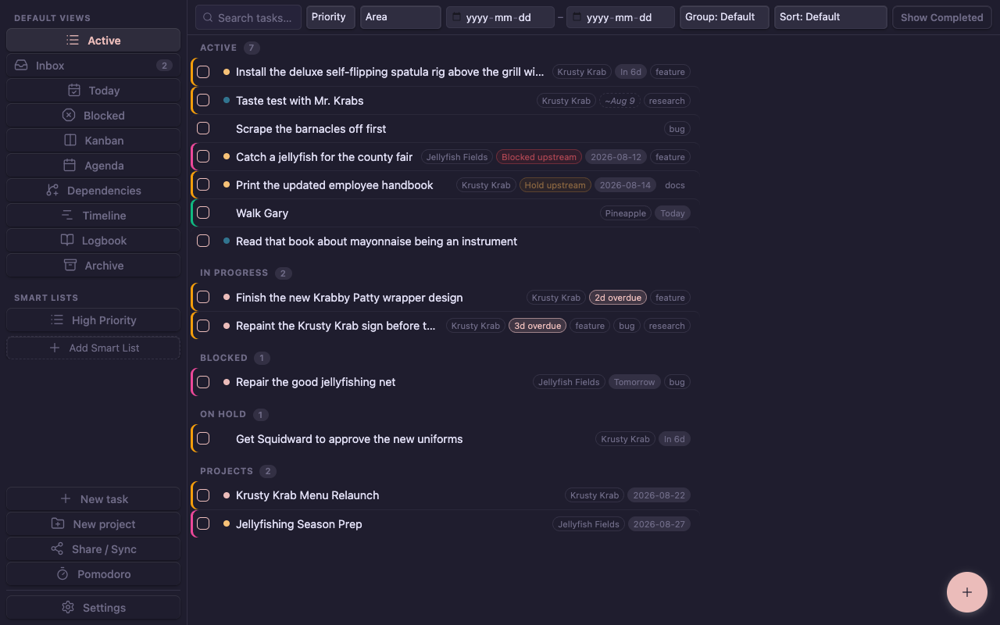
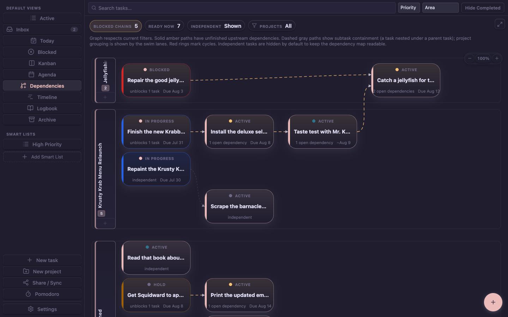
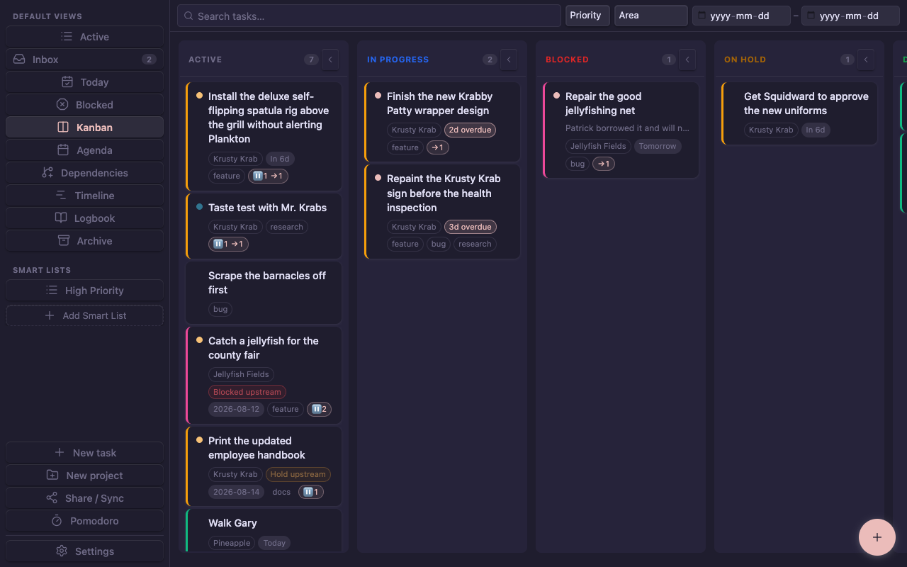
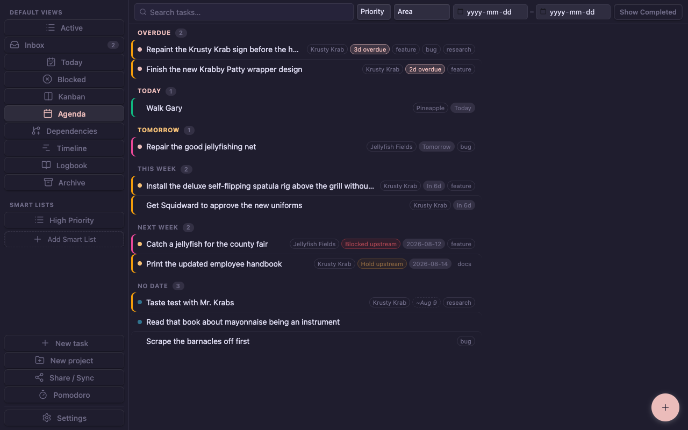
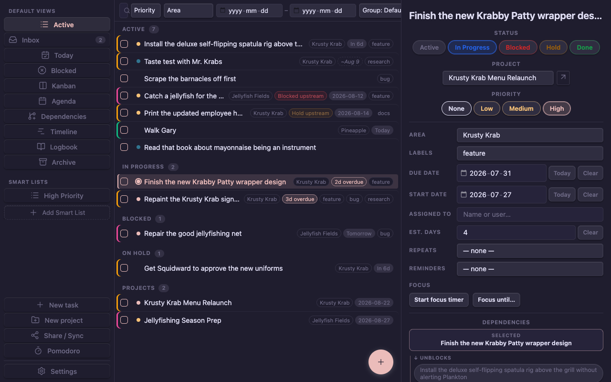
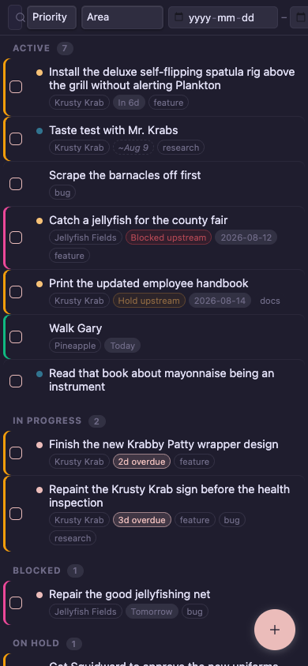

# TTasks

Task management for [Obsidian](https://obsidian.md) with kanban, dependency
tracking, an agenda, and a dependency graph — stored as plain markdown
frontmatter.

TTasks exists to replace a patchwork of QuickAdd + Meta Bind + Dataview with one
cohesive plugin, without giving up the thing that makes Obsidian worth using:
**your data stays plain, readable markdown.** Every task is a normal note with
normal frontmatter. Disable the plugin and you still have a folder of readable
files — no proprietary database, no lock-in.

> **Status: early.** Versions are `0.x`, the schema is still moving (a `ttask_*`
> property prefix is planned), and TTasks is **not** in Obsidian's community
> plugin list. Install it via BRAT if you want to follow along.



*Screenshots use fictional sample data, not a real vault.*

## What makes it different

Most task plugins model a flat list with dates. TTasks models **work that depends
on other work**:

- **Dependency tracking** — `depends_on` / `blocks`, maintained as a real forward
  and reverse index, with cycle detection.
- **A dependency graph** — an interactive, pannable/zoomable view with project
  swim-lanes, a "ready now" highlight, and chain tracing, so you can see what's
  genuinely unblocked rather than what merely has the earliest date.
- **Blocker visibility** — blocked tasks are surfaced, not buried, and blocked
  status propagates along the dependency chain (derived, never written).
- **Realistic planning** — a Today list ordered so ready-to-work tasks float
  above blocked ones, plus a working-day calendar with holidays and per-area
  workweeks.

### The dependency graph

Project swim-lanes, dependency edges, cycle detection, and a "ready now" filter —
so you can see what's genuinely unblocked. Dependencies cross project boundaries.



### Kanban, agenda, and detail

Blocked and held state propagates along the chain, shown as an **upstream** badge
on everything downstream, so a task waiting three hops back still reads as
blocked.







### Mobile



## Features

**Views** — List, Inbox, Today, Blocked, Kanban, Agenda, Dependencies, Timeline
(Gantt-style), Logbook, and Archive. Plus **Smart Lists**: saved custom queries
built in a visual editor or raw JSON.

**Task management** — create/edit modals, a detail pane, task duplication, batch
operations, multi-select, keyboard navigation, and quick actions (desktop
commands plus a mobile hold menu).

**Dates & recurrence** — start/due dates, estimated days, `status_changed`
tracking, reminders with snooze and per-task overrides, and recurring tasks with
correct month-end behaviour (a "31st of the month" schedule stays on the 31st
instead of collapsing onto February's day).

**Pomodoro** — a native focus timer (no external dependency, works on mobile):
per-task or untethered sessions, a dedicated pane, a desktop status-bar
countdown, "focus until 3:30pm" planning, and an appendable CSV session log.

**Share / Sync** — export a filtered subset of tasks as JSON or TOON to paste
into an AI assistant, with message presets and a notes policy; then paste the
reply back and review a per-item bulk-edit summary before applying it.

**Capture** — scan daily notes and other configured sources for `- [ ]`
checkboxes and promote them into real tasks, keeping the source line in sync when
you complete them.

**Mobile** — first-class. `isDesktopOnly: false`; layouts, hit targets, and the
graph are all built for a phone.

## Install

TTasks is not in the community plugin list. Use
[BRAT](https://github.com/TfTHacker/obsidian42-brat):

1. Install and enable BRAT from Community Plugins.
2. **BRAT → Add Beta Plugin** → `TWDickson/ttasks`.
3. Enable **TTasks** in Community Plugins.

Or install manually: download `main.js`, `manifest.json`, and `styles.css` from
the [latest release](https://github.com/TWDickson/ttasks/releases/latest) into
`<vault>/.obsidian/plugins/ttasks/`, then reload Obsidian.

Requires Obsidian **1.7.2** or newer.

## Getting started

1. Open settings and set the **tasks folder** — every task and project note lives
   there.
2. Run **TTasks: Open board** (or click the ribbon icon).
3. Run **TTasks: New task**. Set an area, a due date, and — the interesting part —
   what it depends on.

Useful commands: `Open board`, `New task`, `New project`, `Jump to task`,
`Insert task link`, `Duplicate task`, `Share / Sync`, `Start Pomodoro`,
`Focus until a time…`, `Open Pomodoro pane`.

## Data model

Each task is a note named `{6hex}-{slug}.md`. Everything structured lives in
frontmatter; the body is yours.

```yaml
---
type: task
name: "Ship the release workflow"
cssclasses: [ttask]
area: Work
status: In Progress
priority: High
labels:
  - feature
parent_task: '[[Tasks/a1b2c3-infra|Infrastructure]]'
depends_on:
  - '[[Tasks/d4e5f6-ci-workflow|CI workflow]]'
blocks: []
start_date: '2026-08-01'
due_date: '2026-08-08'
estimated_days: 2
created: '2026-07-28'
completed: null
status_changed: '2026-08-01'
---

Free-form notes go here. The plugin renders all structured UI on top.
```

- **`type`** is `task` or `project`; a project groups tasks via `parent_task`.
- **`depends_on`** is what you edit. **`blocks`** is its reverse index and is
  maintained automatically — don't set it by hand.
- Wiki-links are stored with aliases (`[[path|Name]]`) so they read as human names
  in Obsidian's own link views and graph.
- **Statuses, priorities, areas, and labels are configurable** in settings. The
  defaults are Active / Future / In Progress / Hold / Blocked / Cancelled / Done.

### A note on dates

Date fields are **local calendar dates**, not timestamps — `due_date: 2026-08-08`
means that calendar day wherever you are, which is what "due Saturday" actually
means to a person. The tradeoff: if you **travel across timezones**, a date does
not shift with you, and "today" is your device's current local day. This is
deliberate, and internal date arithmetic is done in UTC to keep it free of DST
artifacts.

## Settings

Tasks folder · statuses, priorities, areas, and labels (all user-defined, with
colours) · completion and start statuses · working calendar (holidays, per-area
workweeks) · reminders · archive and auto-archive · kanban card fields · capture
sources · Pomodoro (durations, long-break interval, auto-start, CSV log) ·
Share/Sync defaults.

## Development

```sh
npm ci
npm run dev     # watch build
npm run check   # lint + build (incl. tsc --noEmit) + test — the full gate
```

Requires **Node ≥ 22** (`.nvmrc` pins 24; CI runs a 22 + 24 matrix).

There's a **visual test rig** that renders the real components against Obsidian's
actual `app.css` and a community theme, so UI changes can be checked without
launching Obsidian:

```sh
npm run rig:sync-css   # fetch Obsidian + theme CSS (from GitHub; no install needed)
npm run rig            # localhost:5199
npm run rig:shots      # desktop/mobile x dark/light screenshot matrix
```

See `CLAUDE.md` for conventions and architecture rules, `PROJECT.md` for what's
open, and `test-rig/README.md` for the rig.

## Licence

[GPL-3.0-or-later](LICENSE).
