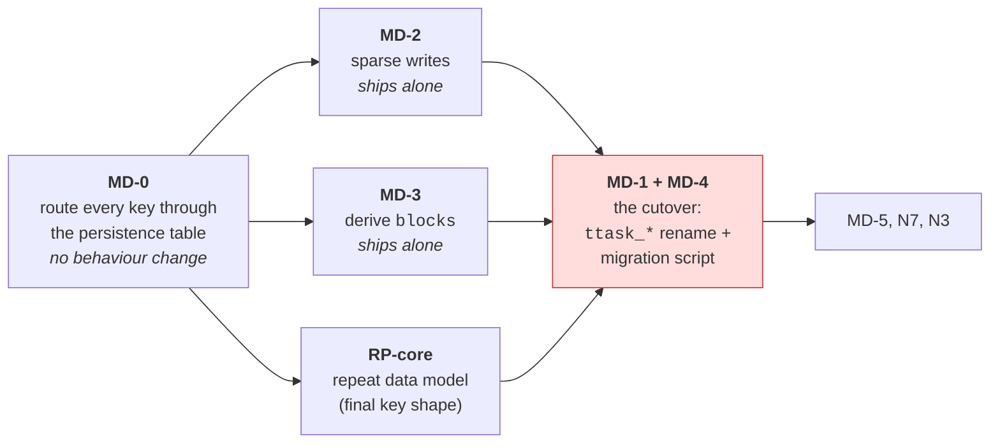
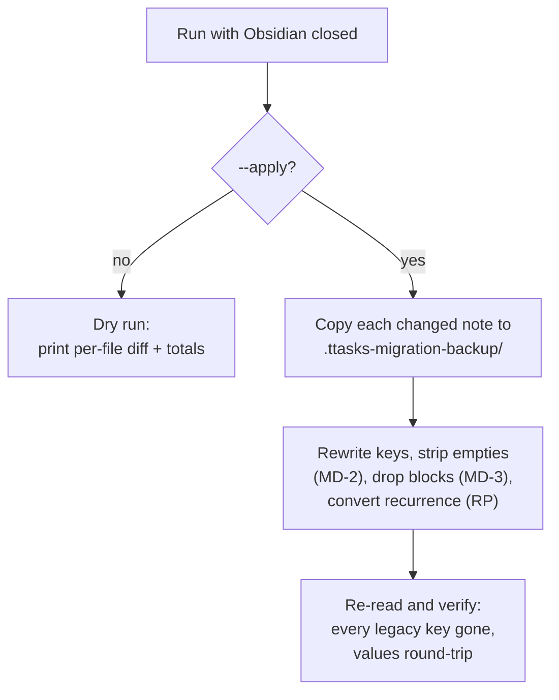
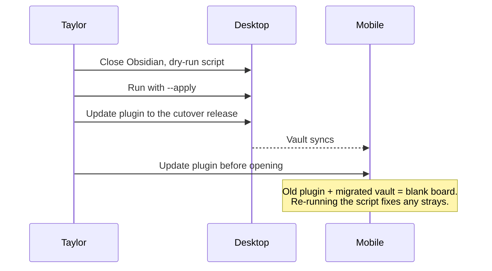

# Schema break plan — MD-1 / MD-2 (and what rides with them)

**Status: approved 2026-10-10** (Taylor: "whatever you think is best"; he is the
only user). **MD-0 is done** (2026-10-10); the rest is open.
Written 2026-10-09 from a survey of every place frontmatter keys are touched.

## TL;DR

The plan in `PROJECT.md` bundles MD-1, MD-2, MD-3 and RP into *one* break so the
vault is migrated once. That's right for the **rename** (MD-1) but **not** for
the others: sparse writes and derived `blocks` only change what the plugin
*stops writing*, so they need no vault conversion and can ship early, on their
own. Splitting them shrinks the risky cutover to just the rename.

Only the red box needs Taylor to run a script on the vault. Everything left of it
is a normal release.

---

## What the survey found

| Finding | Consequence |
| --- | --- |
| `TASK_PERSISTENCE.fmKey` already centralises keys for **create** and **read** (AR-3). | The rename itself is mostly editing one table. |
| But **~5 store files bypass it** with literal keys: `TaskWriter` (~12 sites), `TaskRelationships`, `ArchiveService`, `TaskStore` (`fm.type = 'project'`), `TaskMigrations`. | Flipping `fmKey` alone would leave these writing/reading the old names → mixed vaults. **This is the real risk**, and the reason for MD-0. |
| In-memory names (`Task.due_date`, query fields, saved views, settings, JSON Share/Sync) are **not** frontmatter keys. | They stay unchanged. Saved queries and the Copilot export contract are unaffected. |
| ~65 test files mention these field names, but most build in-memory `Task`s. | Only tests feeding **raw frontmatter** change; expect a modest, mechanical diff. |
| Non-Task keys exist: `cssclasses`, `archive_history`, `pomodoro_count`, `focused_minutes`. | Need decisions below. |
| `TaskMigrations` holds dev-era commands (category→area, etc.). | Deleted at MD-4, per the existing plan. |

---

## Step by step

### MD-0 — one door for frontmatter keys *(no behaviour change; ship any time)*

- Add `fmKey(field)` (and a small `EXTRA_KEYS` for `cssclasses`, `archive_history`)
  next to the table.
- Replace every literal in the five store files with it.
- Add a boundary test that fails on a raw legacy-key literal in `src/store/`, so
  the bypass can't come back (same pattern as `architectureBoundaries.test.ts`).

*Why first:* it turns the cutover from "hunt for every string" into "edit one
table", and it's verifiable today because nothing changes.

### MD-2 — sparse writes *(independent)*

- `onCreate: 'always'` → `'when-set'` for optional fields; keep always-written:
  `type`, `name`, `status`, `created` (+ `cssclasses`).
- `update()` **deletes** a key when its value becomes empty instead of writing
  `null` / `""` / `[]`.
- Reader already tolerates absent keys (every `decode` kind has a fallback).
- Existing notes keep their full key sets until the migration strips them.

*Trade-off to accept:* Obsidian's Properties panel only shows keys that exist, so
a hand-editing user adds `due_date` via "Add property". TTasks' own UI is
unaffected.

### MD-3 — derive `blocks` *(independent)*

- `TaskStore` computes `blocks` from every task's `depends_on` at load (one O(n)
  pass; the store already holds all tasks, so consumers of `task.blocks` don't
  change).
- Writers stop writing it; delete the sync machinery and the `sync-blocks`
  command.
- Side benefit: half of the "renamed task leaves stale aliases" bug disappears.
- Stale stored `blocks` keys are ignored until the migration strips them.

*Departs from the current plan:* `PROJECT.md` says to do this inside the schema
break "not a second one". That reasoning assumed each change forces a vault
conversion; this one doesn't.

### RP-core — the repeat data model *(before the cutover)*

The cutover must migrate `recurrence`, `recurrence_type`, `recurrence_anchor_day`
straight into their **final** shape (`ttask_repeat_*`, already specified in
`PROJECT.md`), or Taylor migrates twice.

- Land `src/repeat/` types + `normalize.ts` + `next.ts` for the **current**
  feature set (daily/weekly/biweekly/monthly/yearly, fixed vs from-completion,
  anchor day) behind the existing UI.
- The richer builder, nth-weekday, working-day targets and end conditions follow
  **after** the cutover — their keys are already defined, so no further break.

*Departs from the current plan:* it treats the full RP redesign as part of the
break. Only its **data model** has to be.

### MD-1 + MD-4 — the cutover *(one release, one script run)*

**Rename rule:** `ttask_` + the `Task` field name, with these exceptions.

| Legacy | New | Note |
| --- | --- | --- |
| `cssclasses` | *(unchanged)* | Obsidian-native property |
| `recurrence`, `recurrence_type`, `recurrence_anchor_day` | `ttask_repeat_*` | per RP spec; converted, not renamed |
| `archive_history` | `ttask_archive_history` | |
| `pomodoro_count`, `focused_minutes` | `ttask_pomodoro_count`, `ttask_focused_minutes` | |
| `blocks` | *(removed)* | MD-3 |
| everything else | `ttask_<name>` | e.g. `ttask_due_date`, `ttask_parent_task` |

**Migration script** `Scripts/migrate-prefixed-schema.mjs`:

- **Idempotent**: re-running on a migrated vault changes nothing. This matters
  because a not-yet-updated device can sync a legacy-format note back in.
- Preserves YAML formatting and comments (uses a document-preserving YAML
  library, not parse-and-dump).
- Scope: the tasks folder only; body text and links untouched.

**Safety net in the plugin** *(small, and I'd call it non-optional)*: if the
tasks folder holds notes with legacy keys and none with `ttask_*`, show a
persistent notice ("run the migration script") and **write nothing**. Without it,
an updated device would show an empty board and happily create mixed-format notes.
This is a tripwire, not legacy support — it reads no old keys.

**Same release** also handles PB-2 (`localStorage` key namespacing) so there's one
cutover for everything, plus README, `CLAUDE.md` file-format section and
`API_DESIGN.md` examples.

**Taylor's rollout:**

---

## Decisions *(resolved 2026-10-10)*

| # | Question | Decision |
| --- | --- | --- |
| 1 | Split vs bundle | **Split.** MD-2 and MD-3 ship ahead of the rename. |
| 2 | RP scope at cutover | **Data model only**; builder UI and richer rules follow. |
| 3 | Always-written keys | **`type`, `name`, `status`, `created`, `status_changed`** (+ `cssclasses`). `status_changed` stays because staleness reads it; everything else is omitted when empty (`priority: None`, null dates, `[]`, `""`). Taylor was unsure; this is the conservative minimum that keeps every current reader correct. |
| 4 | Unmigrated-vault tripwire | **Yes.** Notice + write nothing. |
| 5 | Prefix scope | **Confirmed**: `cssclasses` stays; everything else is `ttask_*`. |
| 6 | Real-vault dry run | **Claude has read access** to the vault via the Obsidian MCP, so the dry run happens in-session against the tasks folder only (read-only). See findings below. |

## Findings from the real vault *(2026-10-10, read-only sample)*

`Planner/Tasks` holds ~170 notes; `Planner/Archive` holds archived ones; the
`Planner/Projects` folder is empty (projects live in `Tasks` with `type: project`).
The script must handle what the sample showed:

- **Foreign keys.** At least one note carries a non-TTasks property
  (`"creation date"`). Unknown keys are left untouched.
- **Mixed link styles.** `parent_task` appears both short
  (`[[57c330-…|Name]]`) and full-path (`[[Planner/Tasks/b8f768-…|Name]]`).
  Link *values* are never rewritten.
- **Orphaned anchor.** `recurrence_anchor_day: 1` on a task with
  `recurrence: null`. Dropped (an anchor without a rule is meaningless).
- **Odd filenames.** Some notes are named `2026-08-23T13-11 - 2b70c3-…md`
  (apparently produced by another tool). The script keys off the folder, not the
  filename pattern.
- **Custom status names** (e.g. `Completed`) are user data, not part of the
  schema; they pass through unchanged.
- **Archive folder is in scope**; `ArchiveService` reads those notes too.

## What I would not do

- Dual-read old and new keys "temporarily" — that's the legacy code the plan
  exists to avoid.
- Rename in-memory `Task` fields — it would break saved queries, views, settings
  and the Share/Sync contract for no benefit.
