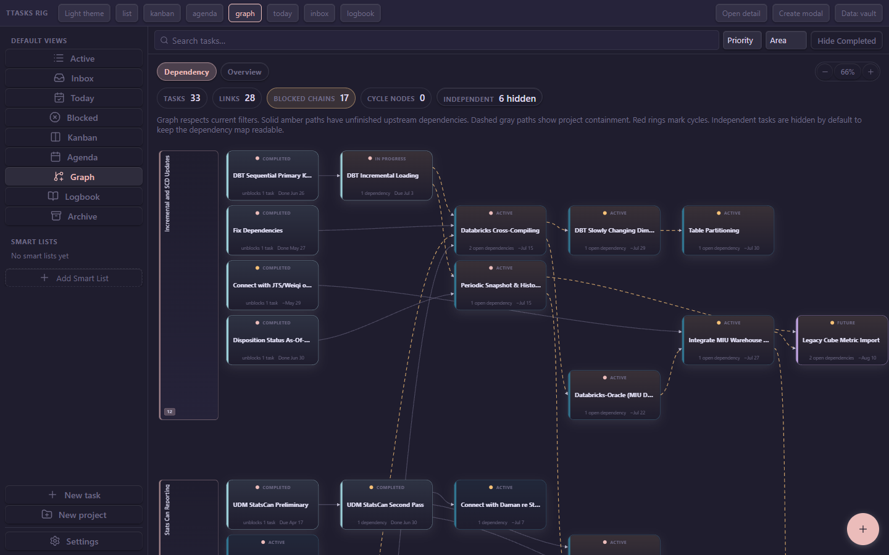
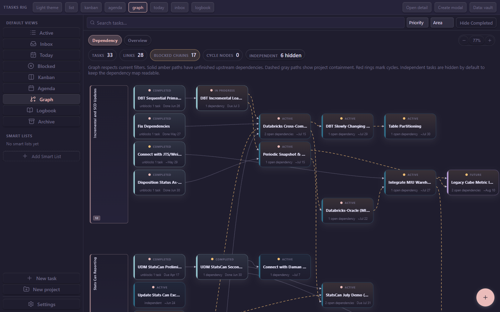
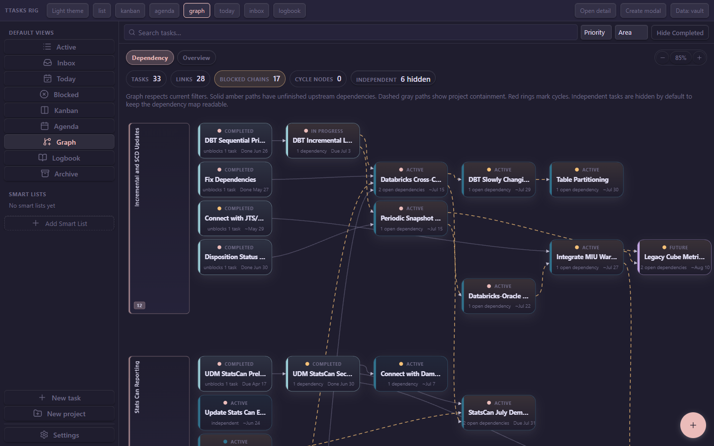

# Dependency-graph layout — C2 workshop (Batch I)

> **Update (2026-07-09) — follow-ups landed.** After the workshop below, Taylor
> greenlit the follow-ups. Landed on this branch: **V1 Compact** density (the
> recommended variant), **F1** (fixed-pixel inter-lane gap: 116px → 50px, and
> the unassigned lane no longer wastes a full empty row), **F5** (unassigned
> lane pinned below all project lanes — fixes the "unassigned task behind the
> UDM lane" report), and **F4** (graph legend corrected: dashed gray = *subtask*
> containment; project grouping is the swim lanes). **F3** (edge-bundle routing)
> was already implemented — `graphEdgeRouting.ts` sorts attachment points by each
> neighbour's Y, which is the anti-crossing technique F3 asked for; no change.
> **F2** (mid-column whitespace) is a **semantic decision left to Taylor** — see
> [Follow-up outcomes](#follow-up-outcomes-2026-07-09). After-shot:
> [`Scripts/graph-c2/after-v1-f1-f5-77pct.png`](../graph-c2/after-v1-f1-f5-77pct.png)
> (fit rose 66% → 77%, two lanes visible, gaps halved).

**Original status:** options for review. This document presents baseline metrics
+ variant proposals; screenshots live in [`Scripts/graph-c2/`](../graph-c2/)
(the rig's own `test-rig/shots/` is gitignored, so review copies were moved in).

---

## TL;DR

- I measured `computeGraphQualityMetrics` on a realistic 20-node / 4-lane fixture
  and read the live counts off the real vault graph in the rig.
- **The topology is already near-optimal:** the fixture lays out with **0 edge
  crossings** and a **bend score of 4** (essentially straight chains); the vault
  graph shows **0 cycle nodes** and no visible crossings.
- **The real problem is footprint, not tangling.** The baseline packs 20 nodes
  into an **1808 × 1770 px** canvas (~3.2 Mpx, aspect ~1.0) — the vault graph
  fits-to-width at only **66%** and still spills the second lane off-screen.
- So the highest-value, lowest-risk lever is **card + gap density**, which does
  **not** touch row/column assignment (crossings stay 0). Two density variants
  cut the canvas area **31%** (V1) and **46%** (V2) and raise fit-to-width to
  **77%** / **85%**.
- Deeper algorithmic ideas (lane-gap compaction, edge-routing, barycentre
  re-ordering) are listed as **follow-ups** — they carry more risk and the
  measurements say they'd chase a problem the current graph mostly doesn't have.

**Recommendation:** adopt **V1 (Compact)** as the default; it's the sweet spot
between density and legibility. V2 (Dense) is worth a look if you routinely work
with 30+ node graphs. Details and trade-offs below.

---

## 1. Baseline metrics

Measured with `buildTaskGraph` + `computeGraphQualityMetrics` on the fixture in
the [appendix](#appendix--reproducing-the-metrics) (23 records: 3 projects, 20
tasks, 18 dependency edges across 4 lanes — chains, a fork, two merges, one
cross-lane dependency per project, plus isolated nodes). Options match the
shipped call in `TaskGraph.svelte` (`nodeWidth 226`, `nodeHeight 122`,
`horizontalGap 52`, `verticalGap 12`, `padding 20`, `paddingLeft 172`).

| Metric | Value |
| --- | --- |
| Nodes | 20 |
| Dependency edges | 18 |
| Parent edges | 0¹ |
| Lanes | 4 |
| Columns × rows | 6 × 13 |
| **Total crossings** | **0** |
| **Total bend score** | **4** |
| Canvas | **1808 × 1770 px** (aspect 1.02, ~3.20 Mpx) |

Per-lane:

| Lane | Nodes | Dep edges | Crossings | Bend |
| --- | --- | --- | --- | --- |
| Website Redesign | 6 | 6 | 0 | 2 |
| Mobile App | 5 | 5 | 0 | 2 |
| Infrastructure | 4 | 2 | 0 | 0 |
| Unassigned | 5 | 1 | 0 | 0 |

¹ Parent edges are only drawn when a task's `parent_task` resolves to another
**task** in view; here every `parent_task` points at a *project* record, and
projects are filtered out of the node set, so no containment edges are emitted.
This is worth flagging on its own (see [Follow-up F4](#follow-ups-need-taylors-greenlight)).

**Real vault graph (what the screenshots show):** the rig renders Taylor's actual
vault — the on-canvas counters read **33 tasks · 28 links · 17 blocked chains ·
0 cycle nodes · 6 hidden independents**, fitting to width at **66%**. It's a
larger, messier graph than the fixture and it corroborates the same story: no
cycles, no obvious crossings, but a lot of empty canvas and cards spilling below
the fold.

### The takeaway

`computeGraphQualityMetrics` is a *crossing/bend* meter, and by that meter the
layout engine is already doing its job — the spine-and-fork row packing plus the
lane-crossing optimiser keep chains straight and untangled. The pain Taylor
flagged in BUGFIX #11 ("layout improvement") is **spatial economy**: big cards,
generous gaps, and lanes that reserve a lot of vertical room. That's a spacing
problem, and spacing is independent of the quality metrics — you can shrink the
footprint by a third without moving a single node relative to its neighbours.

---

## 2. Variants

All three variants are **pure spacing changes** — same fixture, same
row/column assignment, so **crossings stay 0 and bend stays 4** in every case.
Only the node dimensions and gaps change. Each was rendered against the real
vault graph in the rig by temporarily editing the constants, screenshotting, then
reverting (nothing is committed to `src/`).

| Variant | nodeW | nodeH | hGap | vGap | Canvas (fixture) | Area | Δ area | Vault fit |
| --- | --- | --- | --- | --- | --- | --- | --- | --- |
| **Baseline** | 226 | 122 | 52 | 12 | 1808 × 1770 | 3.20 Mpx | — | **66%** |
| **V1 Compact** | 196 | 96 | 40 | 10 | 1568 × 1408 | 2.21 Mpx | **−31%** | **77%** |
| **V2 Dense** | 176 | 84 | 32 | 8 | 1408 × 1228 | 1.73 Mpx | **−46%** | **85%** |
| **V3 Airy** | 240 | 122 | 64 | 20 | 1952 × 1866 | 3.64 Mpx | +14% | (not shot) |

V3 (Airy) is included only to show the other direction is strictly worse for this
graph — more whitespace, more panning. Not recommended; not screenshotted.

### Baseline — 66% fit



Tall 122 px cards, wide gaps. Lane 1 ("Incremental and SCD Updates") uses the top
half; lane 2 ("Stats Can Reporting") is pushed almost entirely below the fold.
The empty band through the middle-left is the clearest symptom — dependency-depth
columns leave a lane's early rows with nothing in the mid columns.

### V1 Compact — 77% fit  ⭐ recommended



`nodeHeight 122→96`, `nodeWidth 226→196`, `horizontalGap 52→40`,
`verticalGap 12→10`. Fit-to-width rises to 77%; the second lane's header and
first rows now appear above the fold. Cards stay comfortably legible — status
pill, title, and the dependency/date footer all still read. Titles truncate a
little sooner ("DBT Sequential Prima…" vs "…Primary K…") but not painfully.

### V2 Dense — 85% fit



`nodeHeight 122→84`, `nodeWidth 226→176`, `horizontalGap 52→32`,
`verticalGap 12→8`. Fit-to-width reaches 85% and most of two lanes fit on one
screen. This is the best density, but titles truncate hardest ("DBT Sequential
Pri…", "Integrate MIU War…") and the cards start to feel cramped — the footer
metadata is close to the title. Good for large graphs / overview scanning; a bit
tight for day-to-day reading.

### Trade-off summary

| | Baseline | V1 Compact | V2 Dense |
| --- | --- | --- | --- |
| Screen economy | ✗ sprawls | ✓ good | ✓✓ best |
| Title legibility | ✓✓ | ✓ | ✗ truncates hard |
| Card breathing room | ✓✓ | ✓ | ✗ tight |
| Mobile (P4 pinch) benefit | — | helps | helps most |
| Risk | — | none (spacing only) | none (spacing only) |

---

## 3. How to land the pick (when Taylor chooses)

A density variant is a **four-number change**, all in `TaskGraph.svelte`:

- `DEPENDENCY_NODE_HEIGHT` (line ~39) — also feeds `buildLaneHeaders`, so lane
  bands track automatically.
- `DEPENDENCY_ROW_GAP` (line ~40).
- `nodeWidth` and `horizontalGap` in the `buildTaskGraph({ … })` call (line ~118).

No changes to `taskGraph.ts`, the crossing optimiser, or edge routing. The node
`<div>` sizes itself from `node.width`/`node.height` (line ~527), so the cards
resize with the layout — no CSS edits needed beyond an optional check that the
84 px card (V2) doesn't clip its footer at the smallest font scale.

I did **not** apply any of these; pick a row from the table above and it's a
one-commit follow-up.

---

## Follow-up outcomes (2026-07-09)

Taylor greenlit the follow-ups. Outcomes, by original label:

- **F1 — Inter-lane gap → LANDED.** Was framed as "drop 2 rows to 1," but the
  row grid can't express a sub-row gap (one empty row = a full node pitch, ~116px
  at compact dims). Implemented a **fixed-pixel inter-lane gap** instead: lanes
  now pack row-contiguous (`endRow + 1`) and each lane after the first is shifted
  down by a cumulative `laneGap` (default 40px). Node `y` carries the shift so
  edges follow; lane-header geometry adds the same offset (`gapOffsetPx` on
  `GraphLane`, threaded through `buildLaneHeaders`). Verified: gaps 116px → 50px,
  headers stay aligned with nodes. Tests in `taskGraph.test.ts`.
- **F5 (Taylor's swimlane report) — LANDED, then refined.** Taylor clarified the
  real pain: an *unassigned* task that depends into a *project* draws a **really
  long cross-lane arrow**. First pass pinned the null lane to the bottom (clean
  ordering) — but that makes those arrows *longer*, not shorter. Final design
  (Taylor's idea — "multiple skinny unassigned riding between the bands"):
  **satellite lanes.** An unassigned task that connects to project tasks is
  pulled out of the shared bottom lane into its own **thin "Unassigned" strip
  parked next to the project it connects to most** (`SATELLITE_LANE_PREFIX` keys,
  positioned by the existing `optimizeLaneBandOrder` distance minimiser). The
  long arrow becomes a short adjacent-band arrow. Truly independent tasks (no
  cross-lane edges) still fall to the bottom lane. Verified on the vault: "Case
  LOB…" (feeds 2 UDM tasks) now rides in a skinny strip directly above the
  "UDM/Dim Model Bug Reports" lane instead of at the far bottom. Columns are
  untouched (F2 stays off — they encode time). Tests: F5, F5b, F5c in
  `taskGraph.test.ts`.
- **F4 — Legend corrected → LANDED (not a defect).** `parentEdgeCount: 0` in the
  workshop fixture was an artifact: every `parent_task` there pointed at a
  *project* (which is a swim lane, not a node), so no edge is drawn — correct.
  Parent edges **do** render for task-under-task (subtask) hierarchies. The graph
  legend said dashed gray = "project containment," which is the misleading part;
  corrected to "**subtask containment** (a task nested under a parent task);
  project grouping is shown by the swim lanes." No layout/behaviour change.
- **F3 — Edge routing → already done.** `graphEdgeRouting.ts`
  `compareByRoutingRank` already orders attachment points by each neighbour's
  actual `y` (directional), same-lane first — precisely the "spread the bundle so
  edges don't cross before they meet the node" technique F3 asked for. Nothing to
  change; crossings remain ~0.
- **F2 — Mid-column whitespace → NEEDS TAYLOR'S CALL (not landed).** The
  remaining void is horizontal: a level-0 task feeding a level-3 task leaves the
  intermediate columns empty in that row (inherent to layered layout, where
  `column = dependency depth from the start`). Compacting it means **pulling
  source-only nodes rightward** to sit just left of their consumer — i.e.
  `column = min(consumer columns) − 1` instead of longest-path-from-source. That
  is a **semantic change**: today a node's column reads as "how deep in the
  dependency chain from the start"; the alternative reads as "how close to its
  dependents." It can also perturb the current 0-crossing result. This is a
  genuine design tradeoff, not a safe mechanical fix, so it's left for Taylor to
  choose. **Note:** V1 + F1 + F5 already reclaimed most of the *practical*
  whitespace (fit 66% → 77%, two lanes on screen), so F2 is now lower urgency.

---

## Appendix — reproducing the metrics

The numbers in §1 came from a throwaway Vitest harness (not committed, to keep
the suite clean). To regenerate, drop this into
`src/store/graph/_c2.test.ts` and run
`npx vitest run src/store/graph/_c2.test.ts`:

```ts
import { describe, it } from 'vitest';
import type { Task } from '../../types';
import { buildTaskGraph, type BuildTaskGraphOptions } from './taskGraph';
import { computeGraphQualityMetrics } from './graphQualityMetrics';

let seq = 0;
function makeTask(o: Partial<Task> & { name: string }): Task {
  seq += 1;
  const id = seq.toString(16).padStart(6, '0');
  const slug = o.name.toLowerCase().replace(/[^a-z0-9]+/g, '-').slice(0, 24);
  return {
    id, slug, path: `Planner/Tasks/${id}-${slug}.md`,
    type: 'task', area: null, priority: 'None', labels: [],
    parent_task: null, depends_on: [], blocks: [],
    blocked_reason: '', assigned_to: '', source: '',
    start_date: null, due_date: null, due_time: null, estimated_days: null,
    created: '2026-06-01', completed: null, status_changed: null,
    recurrence: null, recurrence_type: null, notes: '',
    reminder_override: null, is_inbox: false, is_complete: false,
    status: 'Active', ...o,
  } as Task;
}
const strip = (p: string) => p.replace(/\.md$/, '');

function fixture(): Task[] {
  const A = makeTask({ name: 'Website Redesign', type: 'project' });
  const aWire = makeTask({ name: 'Wireframes', parent_task: strip(A.path), start_date: '2026-06-02' });
  const aDesign = makeTask({ name: 'Visual design', parent_task: strip(A.path), start_date: '2026-06-06', depends_on: [strip(aWire.path)] });
  const aImpl = makeTask({ name: 'Implement pages', parent_task: strip(A.path), start_date: '2026-06-12', depends_on: [strip(aDesign.path)] });
  const aCopy = makeTask({ name: 'Write copy', parent_task: strip(A.path), start_date: '2026-06-12', depends_on: [strip(aDesign.path)] });
  const aTest = makeTask({ name: 'Cross-browser test', parent_task: strip(A.path), start_date: '2026-06-18', depends_on: [strip(aImpl.path)] });
  const aLaunch = makeTask({ name: 'Launch site', parent_task: strip(A.path), start_date: '2026-06-22', depends_on: [strip(aTest.path), strip(aCopy.path)] });
  const B = makeTask({ name: 'Mobile App', type: 'project' });
  const bSpec = makeTask({ name: 'API spec', parent_task: strip(B.path), start_date: '2026-06-04', depends_on: [strip(aDesign.path)] });
  const bBuild = makeTask({ name: 'Build app shell', parent_task: strip(B.path), start_date: '2026-06-10', depends_on: [strip(bSpec.path)] });
  const bAuth = makeTask({ name: 'Auth flow', parent_task: strip(B.path), start_date: '2026-06-14', depends_on: [strip(bBuild.path)] });
  const bSync = makeTask({ name: 'Offline sync', parent_task: strip(B.path), start_date: '2026-06-14', depends_on: [strip(bBuild.path)] });
  const bQa = makeTask({ name: 'QA pass', parent_task: strip(B.path), start_date: '2026-06-20', depends_on: [strip(bAuth.path), strip(bSync.path), strip(aLaunch.path)] });
  const C = makeTask({ name: 'Infrastructure', type: 'project' });
  const cCi = makeTask({ name: 'CI pipeline', parent_task: strip(C.path), start_date: '2026-06-03' });
  const cDeploy = makeTask({ name: 'Deploy targets', parent_task: strip(C.path), start_date: '2026-06-08', depends_on: [strip(cCi.path)] });
  const cMonitor = makeTask({ name: 'Monitoring', parent_task: strip(C.path), start_date: '2026-06-15', depends_on: [strip(cDeploy.path)] });
  const cAudit = makeTask({ name: 'Security audit', parent_task: strip(C.path), start_date: '2026-06-25' });
  const uReview = makeTask({ name: 'Quarterly review', start_date: '2026-06-05' });
  const uBudget = makeTask({ name: 'Budget planning', start_date: '2026-06-05', depends_on: [strip(uReview.path)] });
  const uHire = makeTask({ name: 'Hire designer', start_date: '2026-06-10' });
  const uOffsite = makeTask({ name: 'Team offsite', start_date: '2026-06-28' });
  const uDocs = makeTask({ name: 'Update docs', start_date: '2026-06-24', depends_on: [strip(aLaunch.path), strip(cMonitor.path)] });
  return [A, aWire, aDesign, aImpl, aCopy, aTest, aLaunch, B, bSpec, bBuild, bAuth, bSync, bQa, C, cCi, cDeploy, cMonitor, cAudit, uReview, uBudget, uHire, uOffsite, uDocs];
}

const BASELINE: BuildTaskGraphOptions = { nodeWidth: 226, nodeHeight: 122, horizontalGap: 52, verticalGap: 12, padding: 20, paddingLeft: 172 };
const VARIANTS: Record<string, BuildTaskGraphOptions> = {
  baseline: BASELINE,
  'V1-compact': { ...BASELINE, nodeWidth: 196, nodeHeight: 96, horizontalGap: 40, verticalGap: 10 },
  'V2-dense': { ...BASELINE, nodeWidth: 176, nodeHeight: 84, horizontalGap: 32, verticalGap: 8 },
  'V3-airy': { ...BASELINE, nodeWidth: 240, nodeHeight: 122, horizontalGap: 64, verticalGap: 20 },
};

describe('C2 workshop metrics', () => {
  it('prints metrics', () => {
    const tasks = fixture();
    for (const [name, opts] of Object.entries(VARIANTS)) {
      const layout = buildTaskGraph(tasks, opts);
      const m = computeGraphQualityMetrics(layout.nodes, layout.edges, layout.lanes);
      console.log(name, {
        canvas: `${Math.round(layout.width)}x${Math.round(layout.height)}`,
        crossings: m.totalCrossings, bend: m.totalBendScore,
        cols: layout.columns, rows: layout.rows,
      });
    }
  });
});
```

Screenshots were produced by editing the four constants in `TaskGraph.svelte` to
each variant's values, running `npm run rig:shots graph-dark`, then
`git checkout -- src/components/TaskGraph.svelte`.
